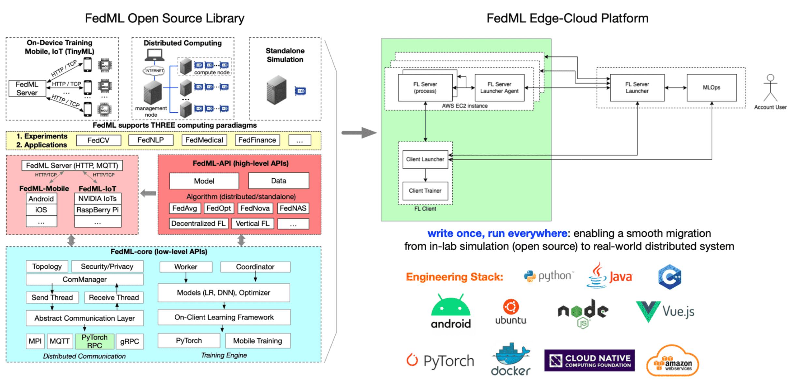

# Overview

The original FedML source code structure was proposed in the [research paper](https://arxiv.org/pdf/2007.13518.pdf) titled *"FedML: A Research Library and Benchmark for Federated Machine Learning"*, which won the [Best Paper Award at the NeurIPS-SpicyFL 2020 Workshop](https://chaoyanghe.com/wp-content/uploads/2021/02/NeurIPS-SpicyFL-2020-Baidu-best-paper-award-He-v2.pdf). 

:::info
You can watch the presentation of the paper by FedML's co-founder [Dr. Aiden Chaoyang He](https://chaoyanghe.com) in this live [video](https://www.youtube.com/watch?v=93SETZGZMyI).
:::

The latest Python code version of the [FedML library](https://github.com/FedML-AI/FedML/tree/master/python/fedml) is now structured as follows:

- **api**: contains the public Python APIs of the FedML library, including APIs for launch, training, deployment, and federated learning.

- **centralized**: provides out-of-the-box code examples for benchmarking centralized training environments.

- **cli**: implements the command line interface (cli) of the FedML library.

- **computing**: implements the distributed scheduler of the FedML library.

- **config**: provides samples for configuring the training environment (e.g., GPU mapping) of FedML workloads.

- **core**: implements the low-level API of the entire FedML library; hence it is considered the backbone of the FedML library. All algorithms and learning scenarios provided by the FedML library are built out of the `core` package. The package provides the implementation of different federated learning topology management options, and various communication protocols such as MPI, NCCL, MQTT, gRPC, PyTorch RPC, as well as other low-level APIs related to security (e.g., `MPC`) and privacy (e.g., `DP`).

- **cross-cloud**: provides the necessary functionalities for executing cross-cloud (e.g., GCP, AWS) workloads. 

- **cross_device**: implements the cross-device federated learning logic (e.g, for smartphones and IoTs).

- **cross_silo**: implements the cross-silo federated learning logic (e.g., cross-organization/centers/account training).

- **data**: contains default datasets and templates on how to write your own custom dataset loaders.

- **device**: implements the computing resource management logic.

- **distributed**: implements the distributed machine learning training logic.

- **fa**: implements the federated analytics (fa) algorithms and related functionalities.

- **ml**: implements the machine learning model aggregators and training engines. 

- **mlops**: implements all APIs related to the machine learning operations platform (nexus.fedml.ai).

- **model**: provides various out-of-the-box machine learning models definitions (also referred to as *model zoo*).

- **serving**: implements the model serving logic tailored for inference on the edge.

- **simulation**: implements the federated learning simulation logic (i.e., FedML Parrot).

- **utils**: implements common utilities shared by all modules.