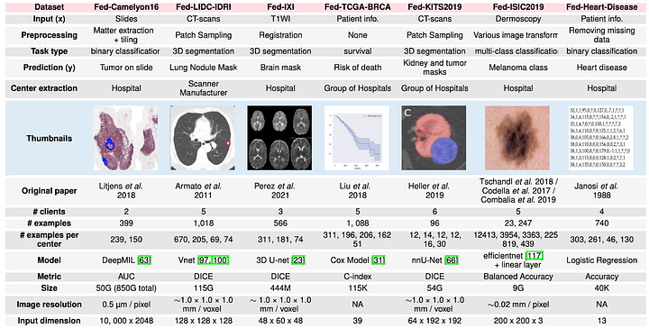

# Datasets and Models

## Industrial Support

FEDML Provides Cross-silo FL Dataset with Okwin, Allowing Research to Face Real Scenario

- Blog Introduction

https://medium.com/@FedML/fedml-provides-cross-silo-fl-dataset-with-okwin-allowing-research-to-face-real-scenario-e64b57c5d767

- Publication in NeurIPS

Publication: https://openreview.net/forum?id=GgM5DiAb6A2

- Source Code

https://github.com/FedML-AI/FedML/tree/master/python/app/healthcare

- Platform Support
https://nexus.fedml.ai

## Research Support

FedML supports comprehensive research-oriented (synthetic and public) FL datasets and models, including four representative synthetic FL datasets used by top-tier publications:

 - **[EMNIST](https://github.com/FedML-AI/FedML/tree/master/data/FederatedEMNIST)**:
EMNIST dataset extends MNIST dataset with upper and lower case English characters. 

- **[CIFAR-100](https://github.com/FedML-AI/FedML/tree/master/data/fed_cifar100)**:
CIFAR-100 dataset consists of 100 image classes with each containing 600 images. 

- **[Shakespeare](https://github.com/FedML-AI/FedML/tree/master/data/fed_shakespeare)**:
Shakespeare dataset is built from the collective works of William Shakespeare. 

- **[Stack Overflow](https://github.com/FedML-AI/FedML/tree/master/data/stackoverflow)**:
Stack Overflow dataset originally hosted by Kaggle consists of questions and answers from the website Stack Overflow. This dataset is used to perform two tasks: tag prediction via logistic regression and next word prediction. 

### Datasets with downloading service and API provided

#### CV

- MNIST

- cifar10

- cifar100

- fed_cifar100

- fed_emnist

- cinic10

- ImageNet

- Landmarks

#### NLP

- shakespeare

- fed_shakespeare

- stackoverflow

#### Finance

- lending_club_loan

- NUS_WIDE

#### Other

- UCI

- Synthetic

- edge_case_examples (tailored for paper *"Attack of the Tails: Yes, You Really Can Backdoor Federated Learning"*)

For a comprehensive dataset list, please check the following APIs:

`fedml.data.load(args)` ([https://github.com/FedML-AI/FedML/tree/master/python/fedml/data](https://github.com/FedML-AI/FedML/tree/master/python/fedml/data)) and 
`fedml.model.create(args)` ([https://github.com/FedML-AI/FedML/tree/master/python/fedml/data](https://github.com/FedML-AI/FedML/tree/master/python/fedml/model))

Their usage in different algorithms are as follows:
### Horizontal Federated Learning:

- Computer Vision: Federated EMNIST + CNN (2 conv layers)
- Computer Vision: CIFAR100 + ResNet18 (Group Normalization)
- Natural Language Processing: shakespeare + RNN (bi-LSTM)
- Natural Language Processing: stackoverflow (NWP) + RNN (bi-LSTM)
- Computer Vision: CIFAR10, CIFAR100, CINIC10 + ResNet
- Computer Vision: CIFAR10, CIFAR100, CINIC10 + MobileNet
- Computer Vision (linear model): MNIST + Logistic Regression
- Computer Vision (linear model): Synthetic + Logistic Regression

### Vertical Federated Learning:
- lending_club_loan + VFL
- NUS_WIDE + VFL

### FedNAS
- cross-silo CV: CIFAR10, CIFAR100, CINIC10 + ResNet
- cross-silo CV: CIFAR10, CIFAR100, CINIC10 + MobileNet

### Split Learning:
- cross-silo CV: CIFAR10, CIFAR100, CINIC10 + ResNet
- cross-silo CV: CIFAR10, CIFAR100, CINIC10 + MobileNet
