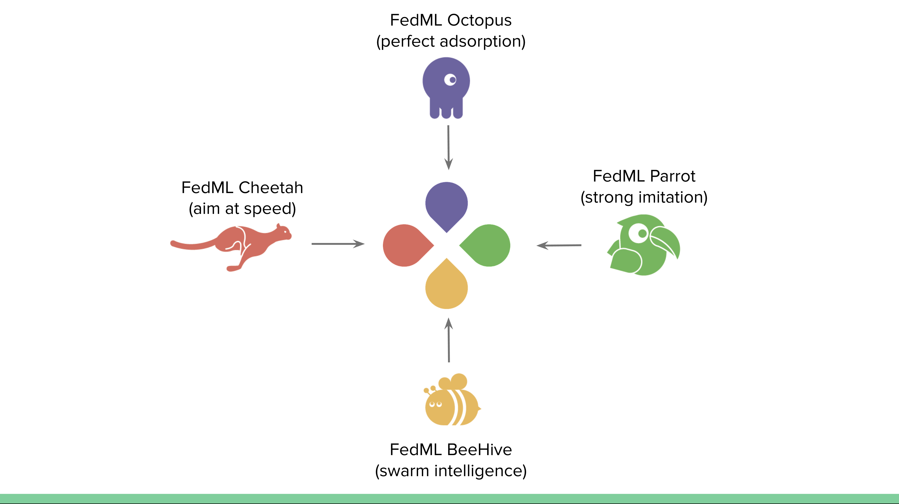
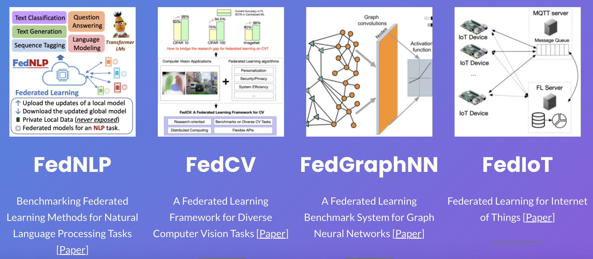
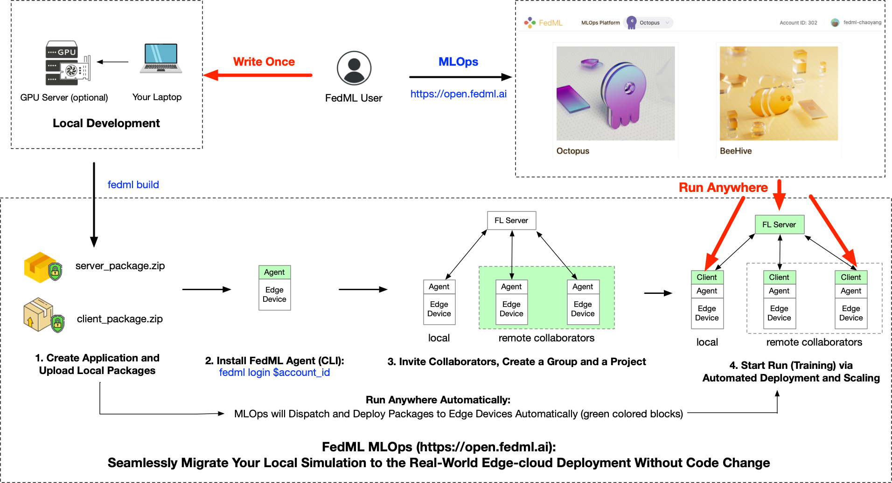

import APIOverview from '../_img/quickstart/apioverview.jpg';

# Quickstart
In this guide, we provide a short overview of the internal mechanics of the Open Source FEDML® Library and how the library interacts with the FEDML® Nexus AI (previously MLOps) platform to submit Federated Learning workflows:

- FedML Open Source Library: https://github.com/FedML-AI/FedML 
- MLOps Platform: https://nexus.fedml.ai

<!-- ## **Overview**



The FedML logo reflects the mission of FedML Inc. We aim to build simple and versatile APIs for machine learning running anywhere and at any scale.
In other words, FedML supports both federated learning for data silos and distributed training for acceleration with MLOps and Open Source support, covering both cutting-edge academia research and industrial grade use cases.

- **FedML Federate Simulation** - Simulating federated learning in the real world: (1) simulate FL using a single process (2) MPI-based FL Simulator (3) NCCL-based FL Simulator (fastest)
- **FedML Fedeate Cross-silo** - Cross-silo Federated Learning for cross-organization/account training, including Python-based edge SDK.
- **FedML Federate Smartphones** - Cross-device Federated Learning for Smartphones and IoTs, including edge SDK for Android/iOS and embedded Linux.

- **FedML Nexus AI - Federate**: FedML's federated learning operation pipeline for AI running anywhere and at any scale. -->

## **Open Source Library**

### Installation

Installing the FedML Library is as easy as follows:

```Python
pip install fedml
```

For more detailed and advanced installation methods, please refer to the [installing FedML](./../../open-source/installation) guide.

### Code Structure Overview

The FedML source code structure was originally proposed in the [research paper](https://arxiv.org/pdf/2007.13518.pdf) titled *"FedML: A Research Library and Benchmark for Federated Machine Learning"*, which won the [Best Paper Award at the NeurIPS-SpicyFL 2020 Workshop](https://chaoyanghe.com/wp-content/uploads/2021/02/NeurIPS-SpicyFL-2020-Baidu-best-paper-award-He-v2.pdf). 

:::info
You can watch the presentation of the paper by FedML's co-founder [Dr. Aiden Chaoyang He](https://chaoyanghe.com) in this live [video](https://www.youtube.com/watch?v=93SETZGZMyI).
:::


The latest Python code version of the [FedML library](https://github.com/FedML-AI/FedML/tree/master/python/fedml) is now structured as follows:

- **api**: contains the public Python APIs of the FedML library, including APIs for launch, training, deployment, and federated learning.

- **centralized**: provides out-of-the-box code examples for benchmarking centralized training environments.

- **cli**: implements the command line interface (cli) of the FedML library.

- **computing**: implements the distributed scheduler of the FedML library.

- **config**: provides samples for configuring the training environment (e.g., GPU mapping) of FedML workloads.

- **core**: implements the low-level API of the entire FedML library; hence it is considered the backbone of the FedML library. All algorithms and learning scenarios provided by the FedML library are built out of the `core` package. The package provides the implementation of different federated learning topology management options, and various communication protocols such as MPI, NCCL, MQTT, gRPC, PyTorch RPC, as well as other low-level APIs related to security (e.g., `MPC`) and privacy (e.g., `DP`).

- **cross-cloud**: provides the necessary functionalities for executing cross-cloud (e.g., GCP, AWS) workloads. 

- **cross_device**: implements the cross-device federated learning logic (e.g, for smartphones and IoTs).

- **cross_silo**: implements the cross-silo federated learning logic (e.g., cross-organization/centers/account training).

- **data**: contains default datasets and templates on how to write your own custom dataset loaders.

- **device**: implements the computing resource management logic.

- **distributed**: implements the distributed machine learning training logic.

- **fa**: implements the federated analytics (fa) algorithms and related functionalities.

- **ml**: implements the machine learning model aggregators and training engines. 

- **mlops**: implements all APIs related to the machine learning operations platform (nexus.fedml.ai).

- **model**: provides various out-of-the-box machine learning models definitions (also referred to as *model zoo*).

- **serving**: implements the model serving logic tailored for inference on the edge.

- **simulation**: implements the federated learning simulation logic (i.e., FedML Parrot).

- **utils**: implements common utilities shared by all modules.


### Pre-Built Jobs
The FedML library facilitates federated learning research and productization in diverse application domains. The library comes with a set of pre-built jobs for different settings:

- **FedNLP**: Federated Learning & Natural Language Processing ([code](https://github.com/FedML-AI/FedML/tree/master/python/examples/federate/prebuilt_jobs/fednlp), [paper](https://arxiv.org/pdf/2104.08815.pdf))
- **FedCV**: Federated Learning & Computer Vision ([code](https://github.com/FedML-AI/FedML/tree/master/python/examples/federate/prebuilt_jobs/fedcv), [paper](https://arxiv.org/pdf/2111.11066.pdf))
- **FedGraphNN**: Federated Learning & Graph Neural Networks ([code](https://github.com/FedML-AI/FedML/tree/master/python/examples/federate/prebuilt_jobs/fedgraphnn), [paper](https://arxiv.org/pdf/2104.07145.pdf))
- **FedIoT**: Federated Learning & Internet of Things ([code](https://github.com/FedML-AI/FedML/tree/master/iot), [paper](https://arxiv.org/pdf/2106.07976.pdf))
- **FedLLM**: Federated Learning & Large Language Models ([code](https://github.com/FedML-AI/FedLLM), [paper](?))
- **FedHealth**: Federated Learning & Healthcare ([code](https://github.com/FedML-AI/FedML/tree/master/python/examples/federate/prebuilt_jobs/healthcare), [paper](https://arxiv.org/pdf/2210.04620.pdf))



<!-- Please read this [guidance](./examples.md) for details -->


### API Overview

Our design philosophy behind FedML's Open Source API is to minimize the number of API endpoints required to define and execute federated learning workloads. To this extend, we have designed the library to consist of eight core Python modules:

<center>
 
</center>

Each module features a unique package entry point (e.g., `fedml.cross-silo`) to manage related APIs from where the FedML users can wrap these APIs to meet their specific needs.


### One-Liner
As you can see below, we can run the FedML Parrot (simulator) with a one-line API command as follows: 

```python
# main.py

import fedml

if __name__ == "__main__":
    fedml.run_simulation()
```

```
python main.py
```

After running the above script, you will see the following output:

```
[FedML-Server(0) @device-id-0] [Sun, 01 May 2022 14:59:28] [INFO] [__init__.py:30:init] args = {'yaml_config_file': '', 'run_id': '0', 'rank': 0, 'yaml_paths': ['/Users/chaoyanghe/opt/anaconda3/envs/mnn37/lib/python3.7/site-packages/fedml-0.7.8-py3.7.egg/fedml/config/simulation_sp/fedml_config.yaml'], 'training_type': 'simulation', 'using_mlops': False, 'random_seed': 0, 'dataset': 'mnist', 'data_cache_dir': './data/mnist', 'partition_method': 'hetero', 'partition_alpha': 0.5, 'model': 'lr', 'federated_optimizer': 'FedAvg', 'client_id_list': '[]', 'client_num_in_total': 1000, 'client_num_per_round': 10, 'comm_round': 200, 'epochs': 1, 'batch_size': 10, 'client_optimizer': 'sgd', 'learning_rate': 0.03, 'weight_decay': 0.001, 'frequency_of_the_test': 5, 'using_gpu': False, 'gpu_id': 0, 'backend': 'single_process', 'log_file_dir': './log', 'enable_wandb': False}
[FedML-Server(0) @device-id-0] [Sun, 01 May 2022 14:59:28] [INFO] [device.py:14:get_device] device = cpu
[FedML-Server(0) @device-id-0] [Sun, 01 May 2022 14:59:28] [INFO] [data_loader.py:22:download_mnist] ./data/mnist/MNIST.zip
[FedML-Server(0) @device-id-0] [Sun, 01 May 2022 14:59:31] [INFO] [data_loader.py:57:load_synthetic_data] load_data. dataset_name = mnist
...
```

To run more advanced simulation use cases (e.g, using MPI), further tuning the federated environment and model hyper-parameters (i.e., configuring the `fedml_config.yaml` file) and further customizing simulated workloads, please refer to the [simulation page](../simulation/simulation.md) and the [examples](../simulation/examples) therein.

### One-Liner Expansion
Here, we demonstrate how the one-line API can be expanded into five API lines. To illustrate this, we will use the FedML Octopus (cross-silo federated learning) [library as an example](https://github.com/FedML-AI/FedML/tree/master/python/examples/federate/cross_silo/mqtt_s3_fedavg_mnist_lr_example). In this example, the FL Client APIs are as follows:

```python
import fedml
from fedml import FedMLRunner

if __name__ == "__main__":
    args = fedml.init()

    # init device
    device = fedml.device.get_device(args)

    # load data
    dataset, output_dim = fedml.data.load(args)

    # load model
    model = fedml.model.create(args, output_dim)

    # start training
    FedMLRunner(args, device, dataset, model).run()
```

Using these APIs, we only need to tune the hyper-parameters through the configuration file `fedml_config.yaml`. For instance:

```yaml
common_args:
  training_type: 'cross_silo'
  scenario: 'horizontal'
  using_mlops: false
  random_seed: 0

environment_args:
  bootstrap: config/bootstrap.sh

data_args:
  dataset: 'mnist'
  data_cache_dir: ~/fedml_data
  partition_method: 'hetero'
  partition_alpha: 0.5

model_args:
  model: 'lr'
  model_file_cache_folder: './model_file_cache' # will be filled by the server automatically
  global_model_file_path: './model_file_cache/global_model.pt'

train_args:
  federated_optimizer: 'FedAvg'
  client_id_list:
  client_num_in_total: 1
  client_num_per_round: 2
  comm_round: 10
  epochs: 1
  batch_size: 10
  client_optimizer: sgd
  learning_rate: 0.03
  weight_decay: 0.001

validation_args:
  frequency_of_the_test: 1

device_args:
  worker_num: 2
  using_gpu: false
  gpu_mapping_file: config/gpu_mapping.yaml
  gpu_mapping_key: mapping_default

comm_args:
  backend: 'MQTT_S3'
  mqtt_config_path: config/mqtt_config.yaml
  s3_config_path: config/s3_config.yaml
  # If you want to use your customized MQTT or s3 server as training backends, you should uncomment and set the following lines.
  #customized_training_mqtt_config: {'BROKER_HOST': 'your mqtt server address or domain name', 'MQTT_PWD': 'your mqtt password', 'BROKER_PORT': 1883, 'MQTT_KEEPALIVE': 180, 'MQTT_USER': 'your mqtt user'}
  #customized_training_s3_config: {'CN_S3_SAK': 'your s3 aws_secret_access_key', 'CN_REGION_NAME': 'your s3 region name', 'CN_S3_AKI': 'your s3 aws_access_key_id', 'BUCKET_NAME': 'your s3 bucket name'}

tracking_args:
  # When running on MLOps platform (nexus.fedml.ai), the default log path is at ~/fedml-client/fedml/logs/ and ~/fedml-server/fedml/logs/
  enable_wandb: false
```


## **MLOps User Guide**

[https://nexus.fedml.ai](https://nexus.fedml.ai)

Currently, the project developed based on FedML Octopus (cross-silo) and Beehive (cross-device) can be smoothly deployed into the real-world system using FedML MLOps.

The FedML MLOps Platform simplifies the workflow of federated learning from anywhere and at any scale.
It enables zero-code, lightweight, cross-platform, and provably secure federated learning.
It enables machine learning from decentralized data at various users/silos/edge nodes, without the need to centralize any data to the cloud, hence providing maximum privacy and efficiency.



The above figure shows the workflow, which is handled by a web UI that avoids using complex deployment. Check out the following live demo for details:


3-Minute Introduction: [https://www.youtube.com/watch?v=E1k05jd1Tyw](https://www.youtube.com/watch?v=E1k05jd1Tyw)

Detailed guidance for the MLOps can be found at [FEDML Nexus AI User Guide](./cross-silo/user_guide.md).


## References

If you use the FEDML Open Source Library for your research projects, please cite the library using the following reference:
```
@article{chaoyanghe2020fedml,
  Author = {He, Chaoyang and Li, Songze and So, Jinhyun and Zhang, Mi and Wang, Hongyi and Wang, Xiaoyang and Vepakomma, Praneeth and Singh, Abhishek and Qiu, Hang and Shen, Li and Zhao, Peilin and Kang, Yan and Liu, Yang and Raskar, Ramesh and Yang, Qiang and Annavaram, Murali and Avestimehr, Salman},
  Journal = {Advances in Neural Information Processing Systems, Best Paper Award at Federate Learning Workshop},
  Title = {FedML: A Research Library and Benchmark for Federated Machine Learning},
  Year = {2020}
}
```

For a full list of publications, see also the [Publications page](../outreach/publications.md).
