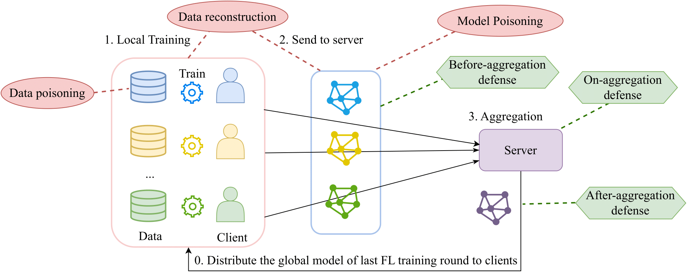
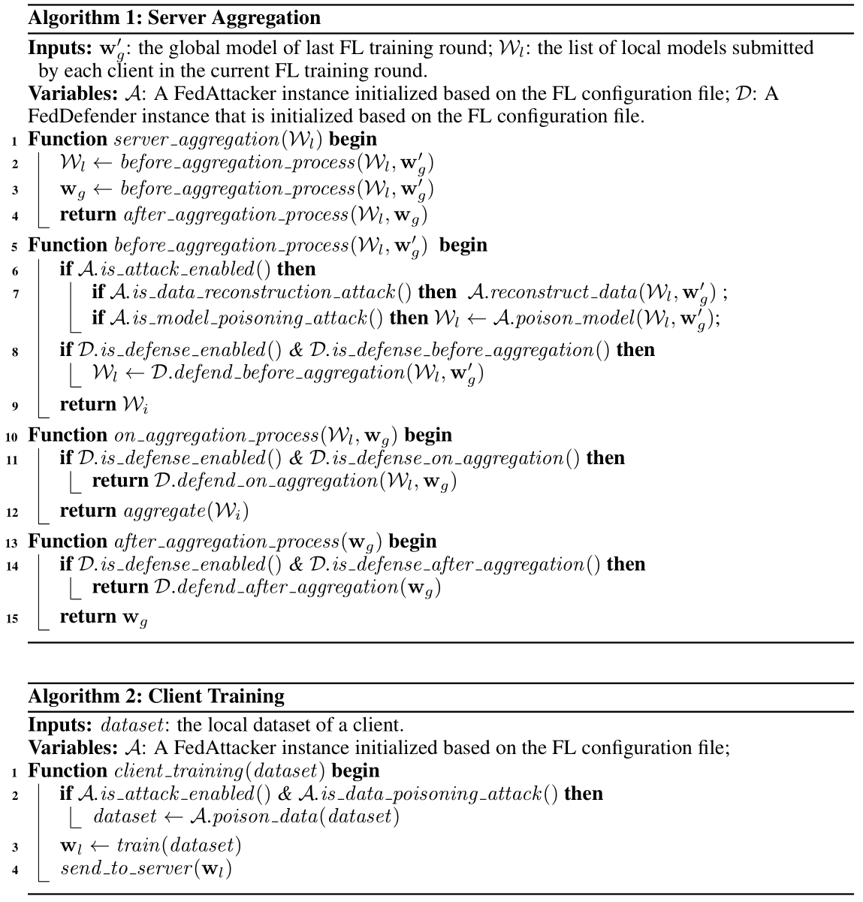

# Overview


FEDML®Federate FedMLSecurity is a benchmark that simulates attacks and defenses in FL. FedMLSecurity comprises two primary components: FedMLAttacker and FedMLDefender. FedMLAttacker simulates attacks in FL to help understand and prepare for potential security risks, while FedMLDefender is equipped with various defense mechanisms to counteract the threats injected by FedMLAttacker.


We summarize the injections of attacks and defenses to the FL framework in FedMLSecurity as follows. 




The highlights of FedMLSecurity are summarized as follows:


1. Enabling benchmarking of various attacks and defenses in FL. FedMLSecurity implements attacks that are widely considered in the literature, including Byzantine attacks of random/zero/flipping modes, label flipping backdoor attack, model replacement backdoor attack, etc. Some of the well-known defense mechanisms supported include Norm Clipping, Robust Learning Rate, Krum (and m-Krum), SLSGD, geometric median, CClip, coordinate-wise median, RFA, Foolsgold, CRFL, and coordinate-wise trimmed mean. 


2. Flexible configuration. FedMLSecurity supports configurations using a .yaml file. Users can utilize two parameters, "enable_attack" and "enable_defense", to activate FedMLAttacker and FedMLDefender. 

3. Supporting customization of attack and defense mechanisms.
We provide APIs in FedMLSecurity to enable users to integrate user-defined attacks and defenses in addition to the default baseline attack and defense mechanisms included in FedMLSecurity.

4. Supporting various models and FL optimizers. FedMLSecurity can be utilized with a wide range of models, including Logistic Regression, LeNet, ResNet, CNN, RNN, GAN, etc. FedMLSecurity is compatible with various FL optimizers, such as FedAVG, FedSGD, FedOPT, FedPROX, FedGKT, FedGAN, FedNAS, FedNOVA, etc.

5. Extensions to federated LLMs and real-world applications. FedMLSecurity is suitable for demonstrating attacks and defenses during training of federated LLMs. We also supports implementing the attack and defense methods on edge devices instead of simulations.


We also provide detailed algorithms for injecting attacks and defenses to different stages of FL training, as follows.




Please read the [paper](https://arxiv.org/pdf/2306.04959.pdf) for details.


```
@article{han2023fedmlsecurity,
  title={FedMLSecurity: A Benchmark for Attacks and Defenses in Federated Learning and Federated LLMs},
  author={Han, Shanshan and Buyukates, Baturalp and Hu, Zijian and Jin, Han and Jin, Weizhao and Sun, Lichao and Wang, Xiaoyang and Xie, Chulin and Zhang, Kai and Zhang, Qifan and others},
  journal={arXiv preprint arXiv:2306.04959},
  year={2023}
}
```


