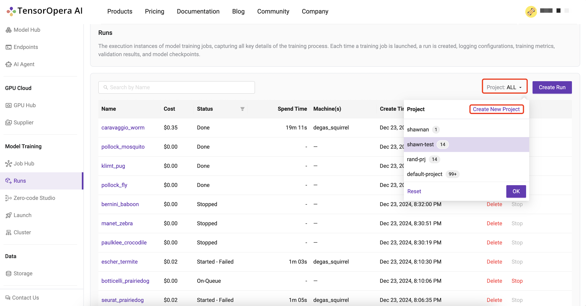

# Launch on Real-time Matching Cloud GPUs (Uber Mode)

## 1. Set up the fedml library
Install Python library for interacting with TensorOpera® Launch APIs.

```bash
pip install fedml
```

## 2. Create `job.yaml` file
Before launch any job, at first, you need to define your job properties in the job yaml file, e.g. workspace, job, bootstrap, etc.

:::tip Tip
The workspace folder is the folder where your source code for execution resides
:::

Below is an example of job yaml file:

```yaml title="job.yaml"
fedml_env:
  project_name: my-project
  
# Local directory where your source code resides.
# It should be the relative path to this job yaml file.
# If your job doesn't contain any source code, it can be empty.
workspace: hello_world

# Bootstrap shell commands which will be executed before running entry commands.
# Support multiple lines, which can be empty.
bootstrap: |
  pip install -r requirements.txt
  echo "Bootstrap finished."


# Running entry commands which will be executed as the job entry point.
# If an error occurs, you should exit with a non-zero code, e.g. exit 1.
# Otherwise, you should exit with a zero code, e.g. exit 0.
# Support multiple lines, which can not be empty.
job: |
    echo "Hello, Here is the launch platform."
    echo "Current directory is as follows."
    pwd
    python hello_world.py
  

computing:
  minimum_num_gpus: 1      # minimum # of GPUs to provision
  # max cost per hour of all machines for your job.
  # E.g., if your job are assigned 2 x A100 nodes (8 GPUs), each GPU cost $1/GPU/Hour, "maximum_cost_per_hour" = 16 * $1 = $16
  maximum_cost_per_hour: $1.75
  resource_type: A100-80G       # e.g., A100-80G, please check the resource type list by "fedml show-resource-type" or visiting URL: https://tensoropera.ai/accelerator_resource_type
```

=======
For more details and properties about the job yaml file, please refer to [job yaml file](../yaml).

:::tip Tip
Directory structure of `hello_world` example
```
tree -l

/example
├── hello_world
|  ├── hello_world.py
├── job.yaml
```
:::


## 3. Launch a job
Launch a job to the GPU Cloud.

```bash
fedml launch /path/to/job.yaml
```


> **_NOTE:_** Note that you might be prompted for **API_KEY** the first time you run the command. Please get this key from your account on TensorOpera® AI Platform. You can also specify the API_KEY with the `-k` option.


After the launch CLI is executed, you will get the following output prompting for confirmation of resources: 


```
❯ fedml launch job.yaml -v
Submitting your job to TensorOpera AI Platform: 100%|█████████████████████████████| 2.92k/2.92k [00:00<00:00, 16.7kB/s]

Searched and matched the following GPU resource for your job:
+-----------+-------------------+---------+------------+-------------------------+---------+------+----------+
|  Provider |      Instance     | vCPU(s) | Memory(GB) |          GPU(s)         |  Region | Cost | Selected |
+-----------+-------------------+---------+------------+-------------------------+---------+------+----------+
| FedML Inc | FEDML_A100_NODE_2 |   256   |  2003.85   | NVIDIA A100-SXM4-80GB:8 | DEFAULT | 1.09 |    √     |
+-----------+-------------------+---------+------------+-------------------------+---------+------+----------+

You can also view the matched GPU resource with Web UI at:
https://tensoropera.ai/launch/confirm-start-job?projectId=1717259066058870784&projectName=my-project&jobId=1717260771043446784
Do you want to launch the job with the above matched GPU resource? [y/N]:
```

You can either confirm through terminal or may even open the run url to confirm.
Once resources are confirmed, it will then run your job, and you will get the following output:

```
Do you want to launch the job with the above matched GPU resource? [y/N]: y

Launching the job with the above matched GPU resource.
Failed to list run with response.status_code = 200, response.content: b'{"message":"Succeeded to process request","code":"SUCCESS","data":null}'

You can track your run details at this URL:
https://tensoropera.ai/run?projectId=1717259066058870784&runId=1717260771043446784

For querying the realtime status of your run, please run the following command.
fedml run logs -rid 1717260771043446784
```

## 4. Realtime status of your run
You can query the realtime status of your run with the following command.

```bash
fedml run logs -rid <run_id>
```

More run management CLIs can be found [here](/open-source/cli/fedml-run)

## 5. You can also view the details of run on the TensorOpera® AI platform:

Log into to the TensorOpera® AI Platform (https://tensoropera.ai) and go to `Model Training > Runs > Project(ALL)`
Select the run you just launched and click on it to view the details of the run.



Alternatively, you can also go to `Model Training > Runs` to find all of your runs scattered across all of your projects unified at a single place.


:::tip Tip
The url link to TensorOpera® AI Platform for your run is printed in the output of the launch command for quick reference.

```bash
You can track your run details at this URL:
https://tensoropera.ai/run?projectId=1717259066058870784&runId=1717260771043446784

For querying the realtime status of your run, please run the following command.
fedml run logs -rid 1717260771043446784
```
This is the quickest, one-click way to go to your run UI.
:::

The Run UI offers a lot of information about your run including Metrics, Logs, Hardware Monitoring, Model, Artifacts, as shown in the image below:


