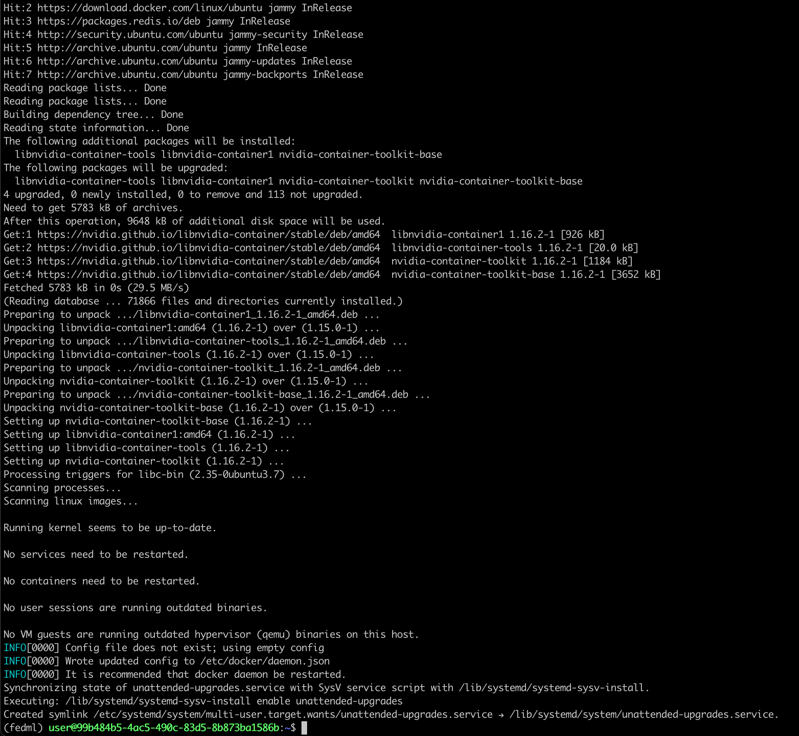

# 🚀 How to onboard Render compute nodes into TensorOpera?

# Introduction

As announced earlier (https://github.com/rendernetwork/RNPs/blob/main/RNP-007.md), the collaboration between TensorOpera and Render aims at bringing Generative AI workloads to Render’s compute network. In particular, by integrating Render’s community of GPU owners into TensorOpera decentralized cloud, GenAI developers will now be offered new compute resources to tap into on TensorOpera GenAI platform.

We are now thrilled to move forward and complete phase 1 of this partnership by onboarding Render compute nodes into TensorOpera.

The process is very simple and each GPU provider from the Render community needs to only follow two steps as described below!


# Onboarding instructions (requiring execution of only 2 commands)

:::note 
The following two commands are to be executed from within the compute nodes which you would like to bind to the TensorOpera platform
:::


### 1. Execute the first command to install fedml and related libraries

```bash
sudo curl -sSf https://doc.fedml.ai/render/shell/install.sh | bash && exec $SHELL
```

<details>
<summary> What does the terminal output of successful execution of this step look like? </summary>

##### You should see output like below in your node terminal

:::tip
The precise results you see on your terminal might differ, so consider the screenshots below as mere examples to ensure it appears somewhat similar.
:::

##### Initial Log Snapshot:


##### End Log Snapshot:


</details>

### 2. Execute the second command to verify installation setup, and to bind your node to TensorOpera Platform

:::caution
During this step, you'll need to input your **render auth token**. Your node's earnings are linked to this token, so ensuring the correct one is entered is essential; otherwise, distributing earnings accurately may not be possible.
:::


```bash
sudo curl -sSf https://doc.fedml.ai/render/shell/setup.sh | bash
```

<details>
<summary> What does the terminal output of successful execution of this step look like? </summary>

##### You should see output like below in your node terminal


</details>


# Frequently Asked Questions?

<details>
<summary> What if my node binding failed? </summary>

Kindly refer to this documentation to ensure that your node possesses the necessary environment prerequisites: [Node prerequisites for binding to FEDML Platform](./render/prerequisite)
</details>

<details>
<summary> How to make sure my node is successfully binded to the platform? </summary>

##### Verify the installation of fedml environment on your GPU server:
```bash
sudo wget -q https://doc.fedml.ai/shell/verify_installation.sh && sudo chmod +x verify_installation.sh && bash verify_installation.sh
```

##### The output should look like below:
```
✔ Miniconda is installed.
✔ fedml is installed in the fedml conda environment.
✔ Docker is installed.
✔ Redis is installed.
✔ NVIDIA Container Toolkit is installed.
✔ All components installed successfully.
```

If any of the above components failed to install, please execute the following command to do a hard clean of fedml environment and re-try the process from the beginning:

```bash
fedml logout; sudo pkill -9 python; sudo rm -rf ~/.fedml; redis-cli flushall; pidof python | xargs kill -9
```

##### Verify the node is successfully binded to platform:

```bash
ps aux | grep fedml | wc -l
```

❌ If the output of above command is anything <10, then that means the node was not binded to the platform:


✅ Otherwise, it means node was successfully binded to the platform:

</details>

<details>
<summary>What are the best GPUs to bind?</summary>
H100, A100, 4090 and 3090 are in highest demand by our customers. Check here for latest details:
<a href="https://fedml.ai/pricing" target="_blank"> https://fedml.ai/pricing</a>

</details>