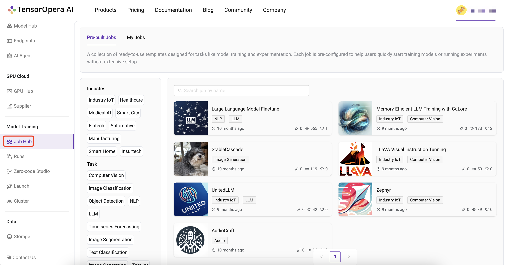
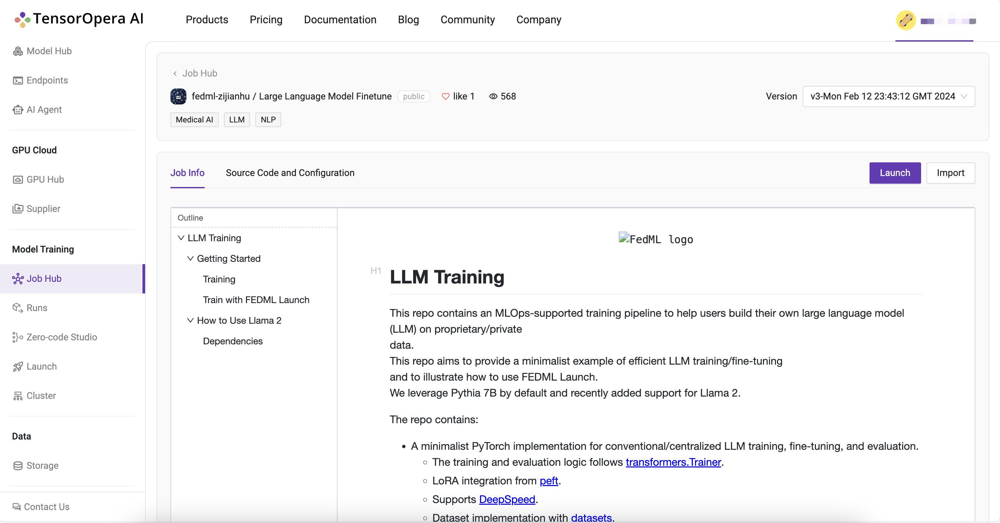
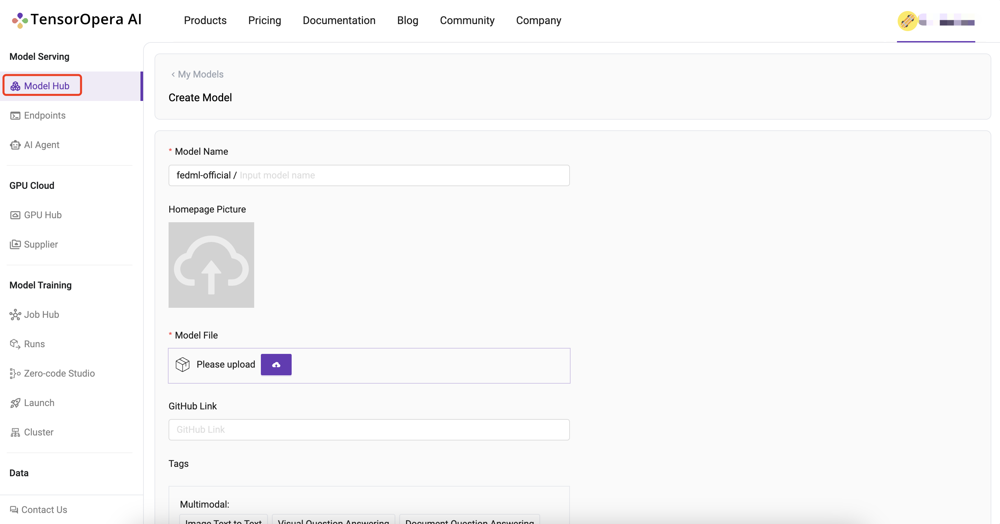
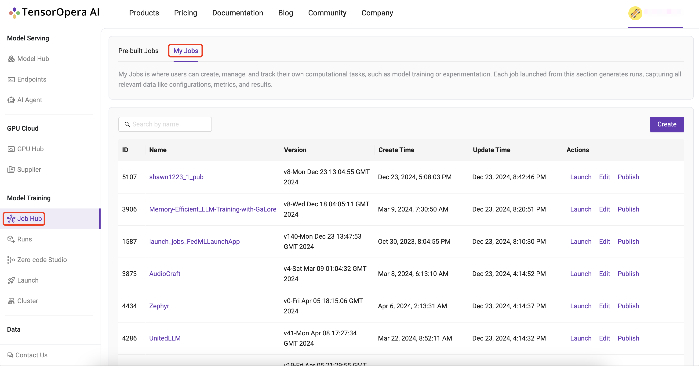
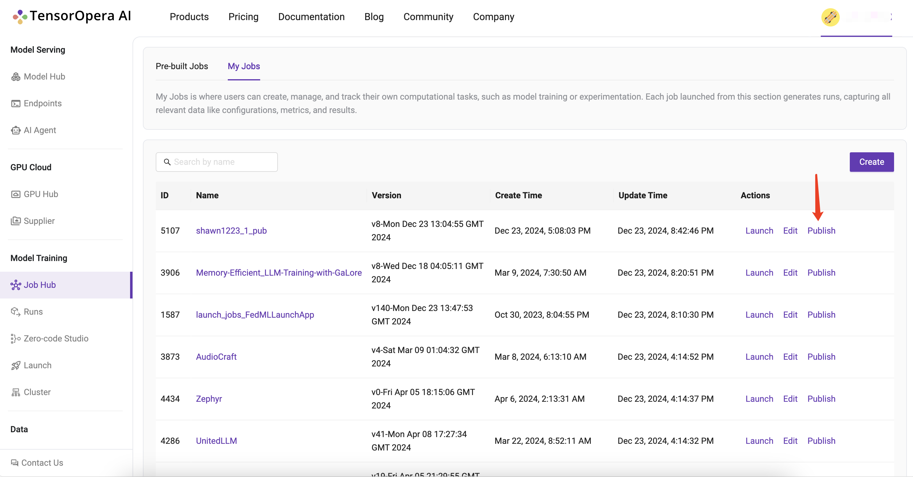

# Job Hub: Pre-built Training Jobs for Diverse Generative AI Models

TensorOpera® Job Hub is the curated pre-built training jobs for TensorOpera® Launch. It provides
1. no-code user experience for developers to run for popular models (e.g., LLM) on training frameworks (e.g., HuggingFace trainer, TensorOpera, DeepSpeed)
2. Reference job templates for machine learning developers to customize their models and training algorithms. 

Under the `Job Hub > Pre-built Jobs` tab, we can find four kinds of pre-built training-related jobs, including General Training, Single GPU training (standalone machine training), Distributed Training, and Cross-cloud Training. 

Under the `Job Hub - Federate` tab, we can find three kinds of pre-built training-related jobs, including Cross Silo FL, Web-based FL, Smartphone-based FL. 

The job detail page shows a pre-built job's introduction, source code and configuration, and two buttons "Launch" and "Import".

## Source Code and Configuration - How We Define the Job

In "Source Code and Configuration", each pre-built job follows a template as follows:
- Workspace "fedml/"
  - Job YAML file "job.yaml"
    - FedML job configuration
    - Job execution workflow 
    For more details of the job YAML arguments, please refer to https://docs.tensoropera.ai/launch/yaml 
  - Bootstrap script "bootstrap.sh"
    - step-by-step setup for the job environment
  - The Python source code for job execution

## Launch a Pre-built Job and Experimental Tracking

Taking a pre-built job for GaLore (https://github.com/jiaweizzhao/galore), an efficient training method for LLM on RTX4090, as an example. Now developers can launch and customize on top of the example GaLore jobs and enjoy freedom from Out-of-Memory fear.
The instructions to launch GaLore pre-built job are as follows:

1. On FedML official website (https://tensoropera.ai/home), you can head to **Launch > Job Hub > Train**, and look for Memory-Efficient LLM Training with GaLore job. The Description tab shows some basic usage for the code, referencing the original GaLore project's README. In the Source Code and Configuration tab, you can examine a more detailed layout and setup of the architecture.

2. Hit the Launch button on the top right, users will be prompted to enter the configuration for the job. Under the Select Job section, click Add, and add “resource_type: RTX-4090”  in the job_yaml > computing section to specify using RTX 4090 for training. Please check the resource type list at https://tensoropera.ai/compute/secure (check the value of Resource Type in each GPU item), or directly visit https://tensoropera.ai/launch/accelerator_resource_type.

3. Once done filling out the hyperparameters, you should be able to launch a full-scale GaLore + Checkpointing Activation pre-training for the LLaMA 7B model with a batch size of 16. Then you can find your experimental tracking results at https://tensoropera.ai/run (see more details on the Section "Experiment Tracking for Large-scale Distributed Training")

Optionally, you could implement Experimental Tracking feature in FedML library. To do this, head to `Model Training > Runs > [Job Name]`, and hit "Add Panel" button under the Metrics tab to add data points to monitor. 

## Import a Pre-built Job for Customization

## Create Jobs and Reuse them for Reproducible Running

To create a job via FedML Launch, execute fedml launch job.yaml in your local workspace. After confirming the resource allocation, submit the job to TensorOpera AI platform.

Navigate to `Model Training > Job Hub > My Jobs` to find a list of recent jobs. Find the Name and Version that match the corresponding job you would have just submitted. Click on the Launch button under the rightmost Actions column, and you are able to reuse the default settings to launch the same job again.

## Contribute More Pre-built Jobs

Navigate to `Model Training > Job Hub > My Jobs` to find a list of recent jobs. Select the Name and Version that match the corresponding job you would like to publish, and click on the Publish button under the rightmost Actions column. 

